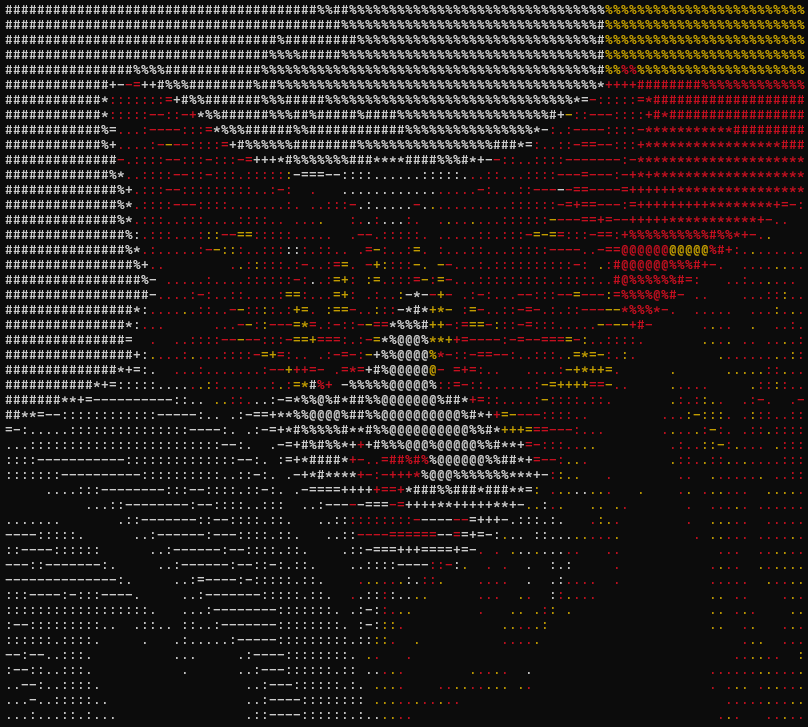

# 🎨 Image to ASCII Art Converter

## 📋 Project Description

This project is an advanced image to ASCII art converter that transforms digital images into textual representations using ASCII characters. The program implements three progressive conversion techniques, each adding more sophistication and visual detail to the final result.

The project uses image processing algorithms, color space conversion (RGB to HSV), edge detection using the Sobel operator, and thresholding techniques (Otsu) to generate high-quality ASCII art in different styles.

## 🚀 Main Features

- **Black and White Conversion**: ASCII representation based on luminous intensity
- **Color Conversion**: Colored ASCII art that preserves the original tones of the image
- **Edge Detection**: Highlights contours and fine details through edge processing
- **Color + Edges Combination**: The most advanced technique combining color and edge definition
- **Automatic size adjustment**: Resizes images while maintaining aspect ratio
- **Multiple format support**: JPG, PNG, WEBP and other PIL-compatible formats

## 🛠️ Technologies Used

- **Python 3.x**
- **NumPy**: Efficient array processing and matrix operations
- **Pillow (PIL)**: Image loading and manipulation
- **SciPy**: Convolution filters for edge detection (Sobel operator)
- **Colorama**: Colored text output in terminal

## 📦 Installation

```bash
# Clone the repository
git clone https://github.com/Neodi/img_to_ASCII_python.git
cd img_to_ASCII_python

# Install dependencies
pip install -r requirements.txt
```

## 💻 Usage

```bash
# Use the default image
python main.py

# Specify a custom image
python main.py path/to/your/image.jpg
```

## 🔬 Processing Phases

### Phase 1: Black and White Conversion 🖤🤍

The first phase converts the image to ASCII art using only the **Value (V)** channel of the HSV color space. This channel represents the luminous intensity of each pixel.

**Process:**
1. RGB to HSV conversion
2. Extraction of the V channel (brightness)
3. Contrast normalization
4. Mapping brightness values to ASCII characters according to visual density
5. Characters used: ` .:-=+*#%@` (from less to more dense)

**Result:** A monochromatic representation that captures the lights and shadows of the original image.


---

### Phase 2: Color Conversion 🌈

The second phase adds chromatic information to the ASCII art using the **Hue (H)** and **Saturation (S)** channels of the HSV space, in addition to the Value channel.

**Process:**
1. Extraction of the H channel (hue) to determine color
2. Division of the color spectrum into 7 ranges:
   - Red: 0-30° and 330-360°
   - Yellow: 30-90°
   - Green: 90-150°
   - Cyan: 150-210°
   - Blue: 210-270°
   - Magenta: 270-330°
3. Saturation evaluation: pixels with low saturation are rendered in white
4. Application of ANSI color codes using Colorama
5. Brightness mapping to ASCII characters as in Phase 1

**Result:** ASCII art with colors that approximate the tones of the original image.



---

### Phase 3: Edge Detection 🔍

The third phase focuses on detecting and highlighting the edges of the image using the **Sobel operator**, a classic gradient-based edge detection algorithm.

**Process:**
1. Application of the Sobel operator in horizontal and vertical directions
2. Calculation of gradient magnitude: $\text{magnitude} = \sqrt{G_x^2 + G_y^2}$
3. Calculation of gradient direction: $\theta = \arctan2(G_y, G_x)$
4. Thresholding using the Otsu method to identify edge pixels
5. Mapping edges to specific ASCII characters according to direction:
   - Horizontal: `-`
   - Vertical: `|`
   - Diagonal: `/` or `\`

**Result:** A representation that emphasizes the contours and structures of the image.


---

### Phase 4: Color + Edges (Advanced Technique) 🎯

The final phase combines the best of the previous techniques: **vibrant color** and **edge definition**, creating the most detailed and visually rich representation.

**Process:**
1. Edge detection using the Sobel operator
2. Thresholding using percentiles (typically 95th percentile) for more pronounced edges
3. For each pixel:
   - If it's an edge: uses specific characters according to direction (`-`, `|`, `/`, `\`)
   - If it's not an edge: uses the ASCII character based on brightness
4. Color application according to pixel hue (Phase 2 method)
5. Final combination that maintains structural detail and chromatic richness

**Result:** ASCII art with color and defined edges, the maximum quality of representation.


---

## 📊 Comparison: Before vs After

### Example 1: Portrait (Sira)

<table>
<tr>
<td width="50%">

**Original Image**


</td>
<td width="50%">

**Final ASCII (Color + Edges)**


</td>
</tr>
</table>

### Example 2: Mona Lisa

<table>
<tr>
<td width="50%">

**Original Image**


</td>
<td width="50%">

**Final ASCII**


</td>
</tr>
</table>

### Example 3: Ubuntu Logo

<table>
<tr>
<td width="50%">

**Original Image**


</td>
<td width="50%">

**Final ASCII**


</td>
</tr>
</table>


### Example 4: Flamingo

<table>
<tr>
<td width="50%">

**Original Image**


</td>
<td width="50%">

**Final ASCII**


</td>
</tr>
</table>

---

## 📐 Implemented Algorithms

### 1. RGB to HSV Conversion
Manual implementation of the color space conversion algorithm using vectorized NumPy operations for maximum efficiency.

### 2. Sobel Operator
Edge detection through convolution with 3x3 Sobel kernels:

```
Gx = [-1  0  1]     Gy = [-1 -2 -1]
     [-2  0  2]          [ 0  0  0]
     [-1  0  1]          [ 1  2  1]
```

### 3. Otsu Thresholding
Automatic method to determine the optimal threshold that separates edge pixels from the background, maximizing inter-class variance.

### 4. Percentile Thresholding
Alternative to Otsu that allows finer control over the level of detail of detected edges.

## 🎯 Configurable Parameters

In `constants.py`:
- `MAX_WIDTH`: Maximum width of ASCII image (default: 200 characters)
- `STURATION_THRESHOLD`: Saturation threshold to consider colors as gray (default: 20)
- `BIG_ASCII_RAMP`: Extended ramp with 70 characters for greater detail
- `SMALL_ASCII_RAMP`: Simplified ramp with 10 characters (` .:-=+*#%@`)

## 📁 Project Structure

```
img_to_ASCII_python/
├── main.py                      # Entry point, executes all phases
├── converter.py                 # Image loading and RGB→HSV conversion
├── img_to_ascii_printer.py      # ASCII art generation algorithms
├── constants.py                 # Constants and configuration
├── doc_images/                  # Example images and documentation
└── README.md                    # This file
```


## 👤 Author

**Neodi**
- GitHub: [@Neodi](https://github.com/Neodi)

## 🙏 Acknowledgments

- Inspired by the YouTube video [I made an ASCII art generator in C](https://youtu.be/t8aSqlC_Duo?si=Jzc3emJvb649t4nt)

---

⭐ If this project has been useful to you, consider giving it a star on GitHub!
