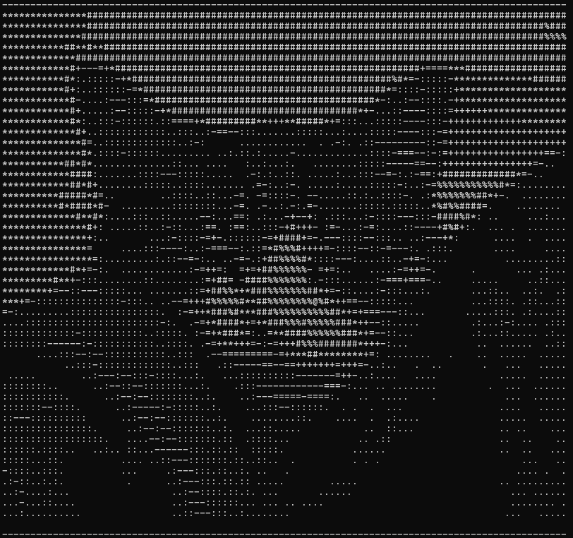
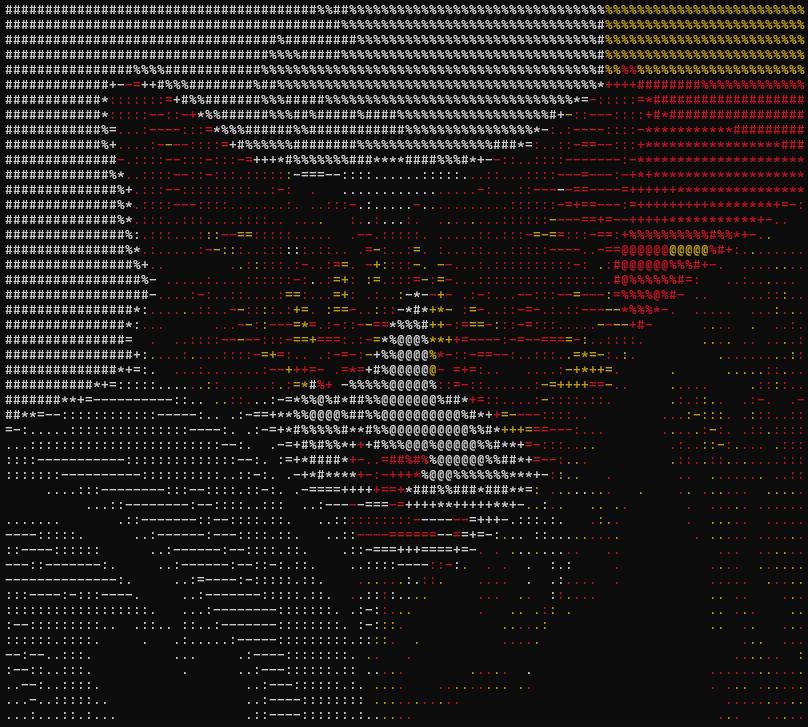
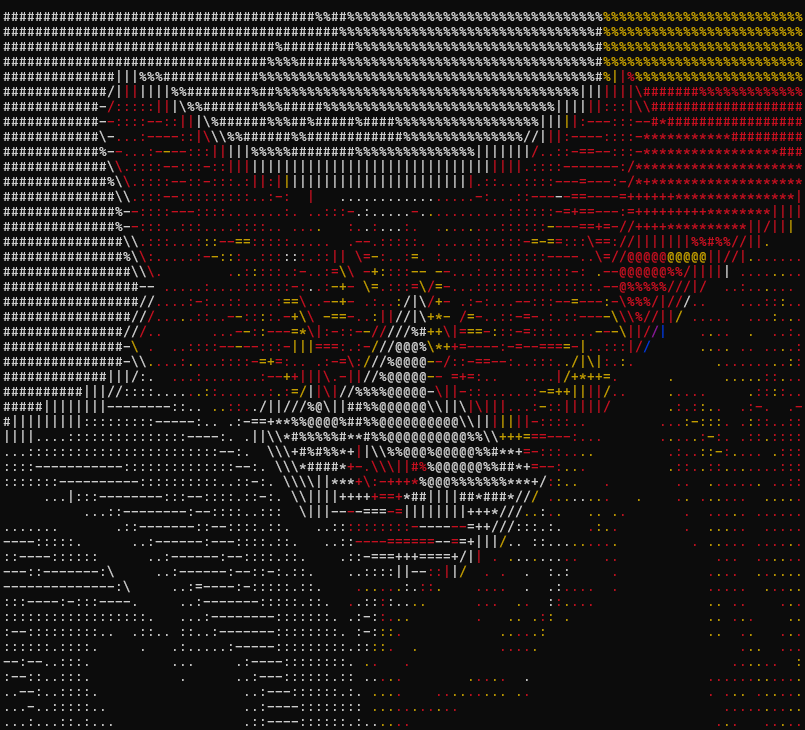
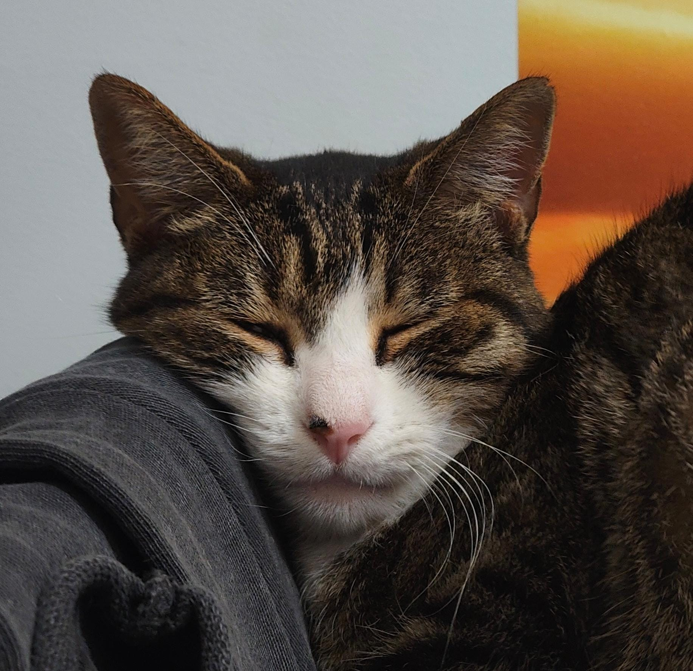
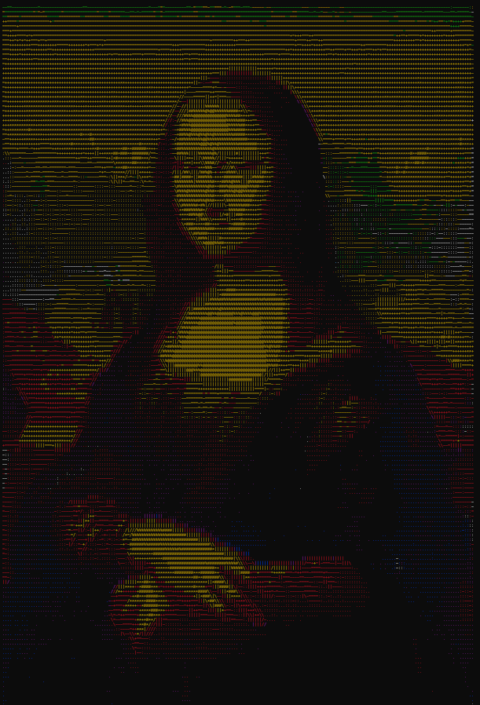
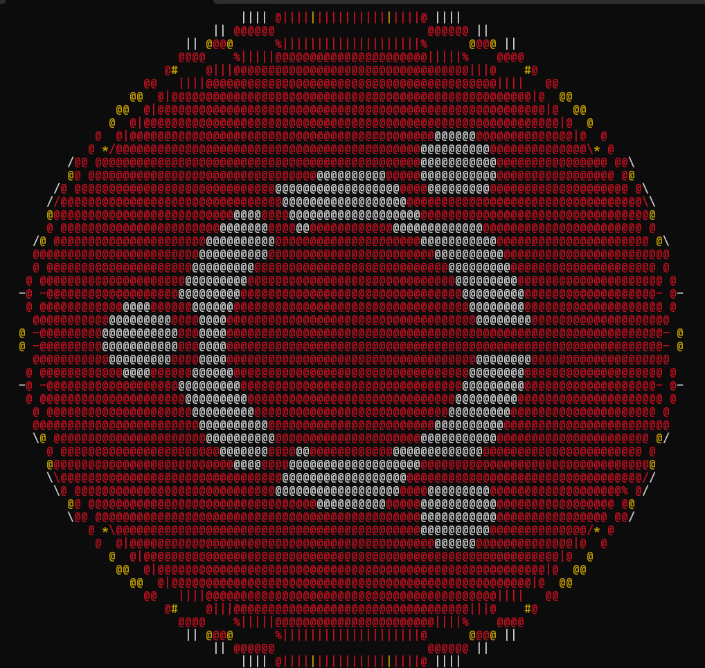

# 🎨 Conversor de Imágenes a Arte ASCII

## 📋 Descripción del Proyecto

Este proyecto es un conversor avanzado de imágenes a arte ASCII que transforma imágenes digitales en representaciones textuales utilizando caracteres ASCII. El programa implementa tres técnicas progresivas de conversión, cada una añadiendo más sofisticación y detalle visual al resultado final.

El proyecto utiliza algoritmos de procesamiento de imágenes, conversión de espacios de color (RGB a HSV), detección de bordes mediante el operador de Sobel, y técnicas de umbralización (Otsu) para generar arte ASCII de alta calidad en diferentes estilos.

## 🚀 Características Principales

- **Conversión en Blanco y Negro**: Representación ASCII basada en la intensidad lumínica
- **Conversión a Color**: Arte ASCII coloreado que preserva los tonos originales de la imagen
- **Detección de Bordes**: Resalta los contornos y detalles finos mediante procesamiento de bordes
- **Combinación Color + Bordes**: La técnica más avanzada que combina color y definición de bordes
- **Ajuste automático de tamaño**: Redimensiona imágenes manteniendo la proporción de aspecto
- **Soporte para múltiples formatos**: JPG, PNG, WEBP y otros formatos compatibles con PIL

## 🛠️ Tecnologías Utilizadas

- **Python 3.x**
- **NumPy**: Procesamiento eficiente de arrays y operaciones matriciales
- **Pillow (PIL)**: Carga y manipulación de imágenes
- **SciPy**: Filtros de convolución para detección de bordes (operador de Sobel)
- **Colorama**: Salida de texto coloreado en terminal

## 📦 Instalación

```bash
# Clonar el repositorio
git clone https://github.com/Neodi/img_to_ASCII_python.git
cd img_to_ASCII_python

# Instalar dependencias
pip install -r requirements.txt
```

## 💻 Uso

```bash
# Usar la imagen por defecto
python main.py

# Especificar una imagen personalizada
python main.py ruta/a/tu/imagen.jpg
```

## 🔬 Fases del Procesamiento

### Fase 1: Conversión en Blanco y Negro 🖤🤍

La primera fase convierte la imagen a arte ASCII utilizando únicamente el canal de **Valor (V)** del espacio de color HSV. Este canal representa la intensidad lumínica de cada píxel.

**Proceso:**
1. Conversión de RGB a HSV
2. Extracción del canal V (brillo)
3. Normalización del contraste
4. Mapeo de valores de brillo a caracteres ASCII según densidad visual
5. Caracteres utilizados: ` .:-=+*#%@` (de menos a más denso)

**Resultado:** Una representación monocromática que captura las luces y sombras de la imagen original.



---

### Fase 2: Conversión a Color 🌈

La segunda fase añade información cromática al arte ASCII utilizando los canales de **Tono (H)** y **Saturación (S)** del espacio HSV, además del canal de Valor.

**Proceso:**
1. Extracción del canal H (tono) para determinar el color
2. División del espectro de color en 7 rangos:
   - Rojo: 0-30° y 330-360°
   - Amarillo: 30-90°
   - Verde: 90-150°
   - Cian: 150-210°
   - Azul: 210-270°
   - Magenta: 270-330°
3. Evaluación de la saturación: píxeles con baja saturación se renderizan en blanco
4. Aplicación de códigos de color ANSI mediante Colorama
5. Mapeo de brillo a caracteres ASCII como en la Fase 1

**Resultado:** Arte ASCII con colores que aproximan los tonos de la imagen original.



---

### Fase 3: Detección de Bordes 🔍

La tercera fase se enfoca en detectar y resaltar los bordes de la imagen utilizando el **operador de Sobel**, un algoritmo clásico de detección de bordes basado en gradientes.

**Proceso:**
1. Aplicación del operador de Sobel en direcciones horizontal y vertical
2. Cálculo de la magnitud del gradiente: $\text{magnitud} = \sqrt{G_x^2 + G_y^2}$
3. Cálculo de la dirección del gradiente: $\theta = \arctan2(G_y, G_x)$
4. Umbralización mediante el método de Otsu para identificar píxeles de borde
5. Mapeo de bordes a caracteres ASCII específicos según la dirección:
   - Horizontal: `-`
   - Vertical: `|`
   - Diagonal: `/` o `\`

**Resultado:** Una representación que enfatiza los contornos y estructuras de la imagen.


---

### Fase 4: Color + Bordes (Técnica Avanzada) 🎯

La fase final combina lo mejor de las técnicas anteriores: **color vibrante** y **definición de bordes**, creando la representación más detallada y visualmente rica.

**Proceso:**
1. Detección de bordes usando el operador de Sobel
2. Umbralización mediante percentiles (típicamente percentil 95) para bordes más pronunciados
3. Para cada píxel:
   - Si es un borde: usa caracteres específicos según dirección (`-`, `|`, `/`, `\`)
   - Si no es borde: usa el carácter ASCII basado en brillo
4. Aplicación de color según el tono del píxel (método de Fase 2)
5. Combinación final que mantiene detalle estructural y riqueza cromática

**Resultado:** Arte ASCII con color y bordes definidos, la máxima calidad de representación.



---

## 📊 Comparación: Antes vs Después

### Ejemplo 1: Retrato (Sira)

<table>
<tr>
<td width="50%">

**Imagen Original**



</td>
<td width="50%">

**ASCII Final (Color + Bordes)**


</td>
</tr>
</table>

### Ejemplo 2: Mona Lisa

<table>
<tr>
<td width="50%">

**Imagen Original**


</td>
<td width="50%">

**ASCII Final**



</td>
</tr>
</table>

### Ejemplo 3: Logo Ubuntu

<table>
<tr>
<td width="50%">

**Imagen Original**


</td>
<td width="50%">

**ASCII Final**



</td>
</tr>
</table>

---

## 📐 Algoritmos Implementados

### 1. Conversión RGB a HSV
Implementación manual del algoritmo de conversión de espacio de color utilizando operaciones vectorizadas de NumPy para máxima eficiencia.

### 2. Operador de Sobel
Detección de bordes mediante convolución con kernels de Sobel 3x3:

```
Gx = [-1  0  1]     Gy = [-1 -2 -1]
     [-2  0  2]          [ 0  0  0]
     [-1  0  1]          [ 1  2  1]
```

### 3. Umbralización de Otsu
Método automático para determinar el umbral óptimo que separa píxeles de borde del fondo, maximizando la varianza entre clases.

### 4. Umbralización por Percentiles
Alternativa a Otsu que permite control más fino del nivel de detalle de bordes detectados.

## 🎯 Parámetros Configurables

En `constants.py`:
- `MAX_WIDTH`: Ancho máximo de la imagen ASCII (por defecto: 200 caracteres)
- `STURATION_THRESHOLD`: Umbral de saturación para considerar colores como grises (por defecto: 20)
- `BIG_ASCII_RAMP`: Rampa extendida con 70 caracteres para mayor detalle
- `SMALL_ASCII_RAMP`: Rampa simplificada con 10 caracteres (` .:-=+*#%@`)

## 📁 Estructura del Proyecto

```
img_to_ASCII_python/
├── main.py                      # Punto de entrada, ejecuta todas las fases
├── converter.py                 # Carga de imágenes y conversión RGB→HSV
├── img_to_ascii_printer.py      # Algoritmos de generación de arte ASCII
├── constants.py                 # Constantes y configuración
├── doc_images/                  # Imágenes de ejemplo y para documentación
└── README.md                    # Este archivo
```


## 👤 Autor

**Neodi**
- GitHub: [@Neodi](https://github.com/Neodi)

## 🙏 Agradecimientos

- Inspirado en el video [I made an ASCII art generator in C](https://youtu.be/t8aSqlC_Duo?si=Jzc3emJvb649t4nt) de YouTube

---

⭐ Si este proyecto te ha sido útil, considera darle una estrella en GitHub!
